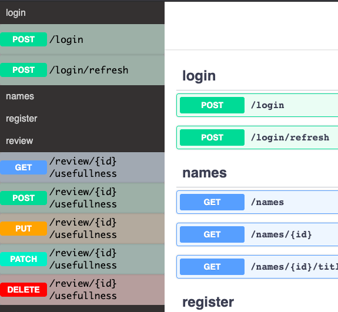

# swagger-sidebar

A simple sidebar to easily navigate through endpoints.



## Usage

just add this script:

```html
...
<script src="https://cdn.jsdelivr.net/npm/swagger-sidebar/lib/bundle.js"></script>
<script>
  const reactroot = document.querySelector("#swagger-ui");
  const container = document.querySelector("body");
  initSidebar(container, reactroot);
</script>
...
```

- `reactroot` is the `div` element containing whole swagger app. this library will add the sidebar before this element inside container. `reactroot` should be the direct child of `container`.

## How it works

it waits for the loading component to disappear and then uses querySelector to find the sections on the page. Then it renders a simple sidebar.
